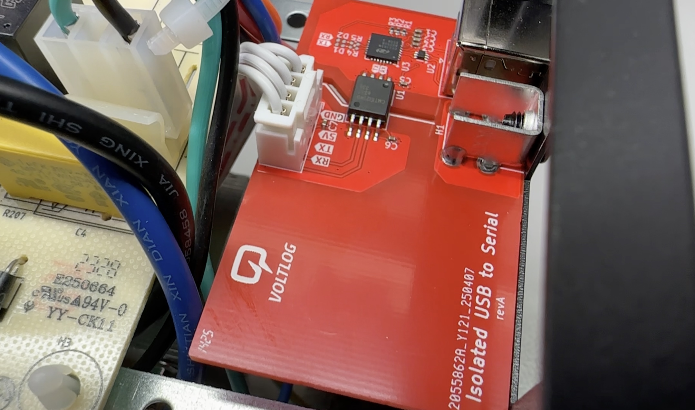

# ups-usb
This repo contains the isolated USB to serial board that I designed for a Serioux LD600LI UPS to get it to talk reliably with NUT.
Project was designed using Kicad V8.  For more information check out [Voltlog #503](https://youtu.be/ZeoCBQmW2Rw)

